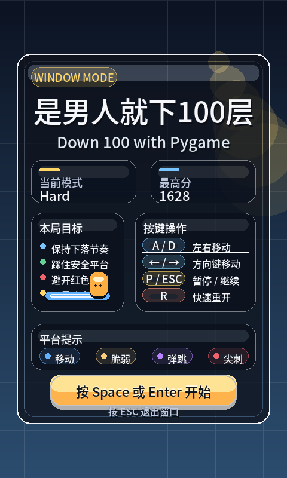
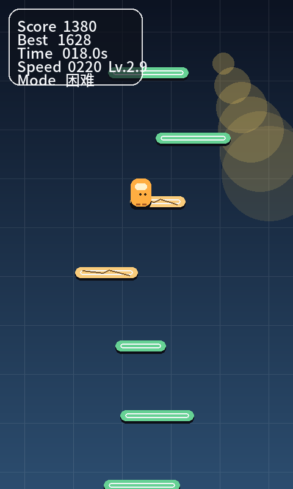
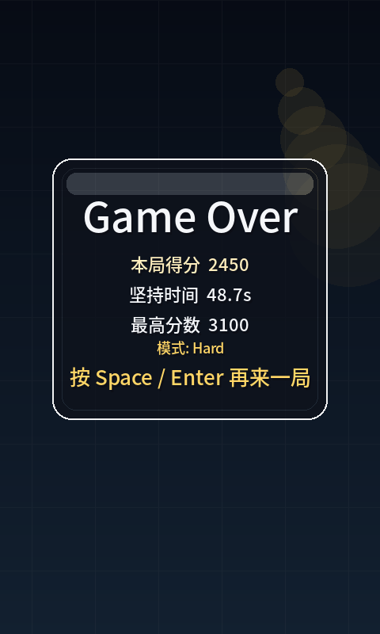

# Floorfall Survivor

Floorfall Survivor is a 2D arcade survival game inspired by the classic "Down 100 Floors" formula. The player keeps falling through a vertical stage, dodging hazards and landing on platforms long enough to survive, score points, and push for a higher best run.

The project currently ships with two playable runtimes:

- `Pygame` desktop client
- `Vue 3 + Vite` web client

It also includes a runtime launcher that lets players choose:

- desktop or web mode
- `easy` or `hard` difficulty

## Screenshots

### Start Menu



### Gameplay



### Game Over



## Features

- Desktop game built with `Python + Pygame`
- Browser game built with `Vue 3 + Vite + Canvas`
- Runtime mode picker with desktop / web selection
- `easy` and `hard` difficulty presets
- Multiple platform types:
  - normal
  - moving
  - fragile
  - spike
  - bounce
- Score system based on survival time and fall distance
- Local best-score persistence
- Responsive web layout with touch controls
- Styled desktop UI with start, pause, HUD, and game-over screens

## Project Structure

```text
.
├── main.py
├── launcher.py
├── build_web.py
├── game.py
├── player.py
├── game_platform.py
├── level_manager.py
├── ui.py
├── settings.py
├── requirements.txt
├── VERSION
├── LICENSE
├── README.md
├── 开发方案.md
├── assets/
└── web/
    ├── package.json
    ├── vite.config.js
    ├── index.html
    ├── src/
    └── dist/
```

## Requirements

- Python `3.10+`
- Node.js `18+`
- npm

## Installation

Install desktop dependencies:

```bash
pip install -r requirements.txt
```

Install web dependencies for development:

```bash
cd web
npm install
```

## Running the Project

### Choose Mode at Runtime

```bash
python3 main.py
```

If a graphical environment is available, the launcher opens a mode picker window. Otherwise, it falls back to a CLI prompt.

### Run Desktop Mode Directly

```bash
python3 main.py --mode desktop --difficulty easy
python3 main.py --mode desktop --difficulty hard
```

### Run Web Mode Directly

```bash
python3 main.py --mode web --difficulty easy
python3 main.py --mode web --difficulty hard
```

Disable automatic browser launch:

```bash
python3 main.py --mode web --difficulty hard --no-browser
```

## Web Build

For local web development:

```bash
cd web
npm run dev
```

To rebuild the static web bundle used by the Python launcher:

```bash
python3 build_web.py
```

`build_web.py` installs dependencies in a temporary directory under `/tmp`, runs the Vite production build there, and then copies the generated bundle back into `web/dist/`.

## Controls

### Desktop

- `A / D` or `Left / Right`: move horizontally
- `Space / Enter`: start or restart
- `P / ESC`: pause / resume
- `R`: quick restart

### Web

- Keyboard controls match the desktop version
- Mobile players can use the on-screen touch buttons

## Difficulty Modes

### Easy

- Denser platform generation
- Wider platforms
- Fewer dangerous platforms
- Slower world-scroll speed

### Hard

- Larger gaps between platforms
- Narrower platforms
- More complex and dangerous platform mixes
- Faster world-scroll speed

## Platform Types

- `Normal`: safe landing platform
- `Moving`: slides horizontally and can carry the player
- `Fragile`: breaks shortly after being stepped on
- `Spike`: kills the player on contact
- `Bounce`: launches the player upward

## Scoring

The score combines:

- survival time
- accumulated fall distance

Best-score persistence:

- Desktop: `best_score.txt`
- Web: browser `localStorage`

## Documentation

- Chinese technical design document: [开发方案.md](./开发方案.md)

## Version

Current project version: `1.0.0`

## License

This repository is released under the [MIT License](./LICENSE).
